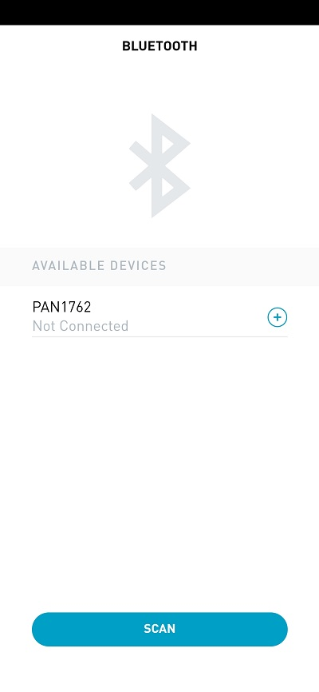
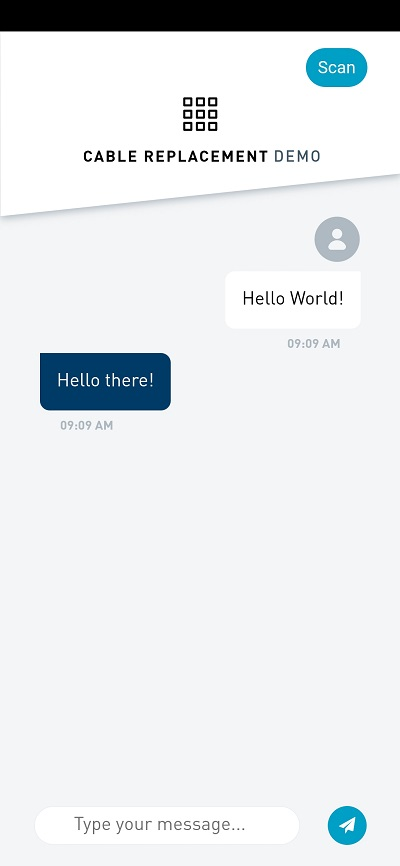

# Connected by Panasonic Industry App
The Connected by Panasonic Industry App is designed to work with wireless connectivity modules from Panasonic Industry and shall:
1) accelerate proof of concept designs
2) provide a starting point for software developers
3) give basic information about available modules

# Cable Replace Demo
One of the featured use case is the cable replacement demo. 
In this case a sort of wireless UART interface will be created via Bluetooth Low Energy enabling to forward incoming data from the hardware UART over BLE to its final destination e.g. a smartphone.

As this is a common use case for BLE, Panasonic decided to extract this demo from the main app and create a sub App which can be easily used as a starting point for own BLE applications.

The demo can be used to quickly connect the existing main application to BLE and receive corresponding data on a mobile device and vice versa.
Furthermore the source code of this particular demo is made available to
a) adjust the existing demo to final requirements e.g. by adding additional buttons or displays on the App
b) understanding the implemented Bluetooth Low Energy communication algorithm and the required command order

This project is based on Ionic, Cordova and Angular. It can be build as PWA, Android or iOS App.

## Getting Started
* [Download and install the installer](https://nodejs.org/) for Node LTS.
* Install the ionic CLI globally: `npm install -g ionic`
* Install the Cordova globally: `npm install -g cordova`
* Install platform dependent packages
  * [Android](https://ionicframework.com/docs/developing/android)
  * [iOS](https://ionicframework.com/docs/developing/ios)
* Clone this repository: `Link to git repository`.
* Run `npm install` from the project root.
* Follow ["Get started with Ionic"](https://ionicframework.com/getting-started) introduction for Android or iOS.

## Deployment
### Android
Run `ionic cordova run android --prod`
### iOS
iOS apps can only be developed on macOS with Xcode installed.

Run `ionic cordova run ios --prod`

## Serve the App
Run `ionic serve`

## App Preview

| [Scan Page](src/app/scan/scan.page.html)  | [Demo Page](src/app/cable-replacement/cable-replacement.page.html)  |
| -----------------| -----|
|  |  |

## Using the Cable Replace Demo
Panasonic Bluetooth Low Energy Module / Evaluation Kit
- Flash the ble_app_uart Firmware .hex file on the kit. If you need further instructions please have a look into the [PAN1780 Module Integration Guide](https://mediap.industry.panasonic.eu/assets/custom-upload/Devices/Wireless%20Connectivity/Bluetooth%20Low%20Energy%20Modules/PAN1780/WM%20PAN1780%20Module%20Integration%20Guide.pdf)

Host PC / Device
- Connect the host PC /device to the Kit 
- For sending messages from your PC to the device you can use the ["Connected by Panasonic Industry" PC Application](https://mediap.industry.panasonic.eu/assets/custom-upload/Devices/Wireless%20Connectivity/Connected%20App/Connected-by-Panasonic-Industry-v1_2.zip), or a terminal programm for serial communication like [HTerm](http://www.der-hammer.info/pages/terminal.html).

Mobile Device
- Deploy and start the App on the device
- Establish the Bluetooth Low Energy connection to the Kit

Now you are ready to send plain text from the module to your device using the cable replacment demo via Bluetooth Low Energy!